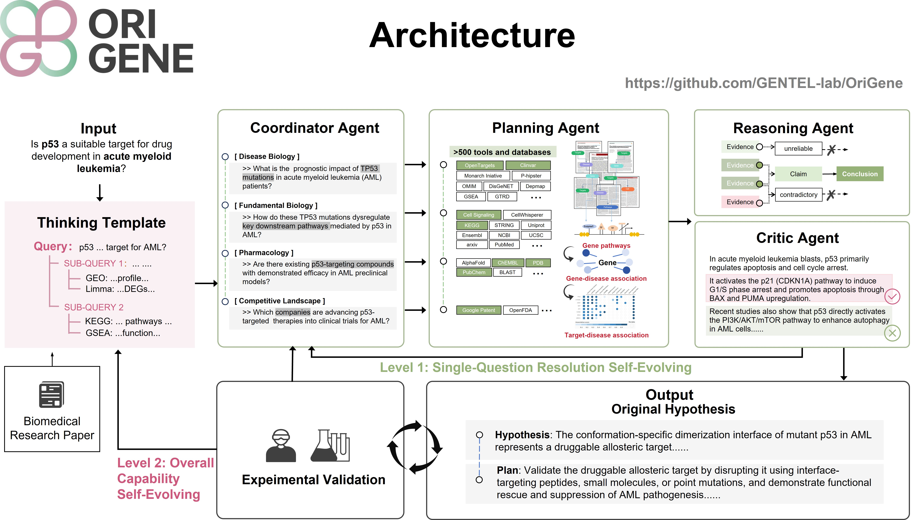
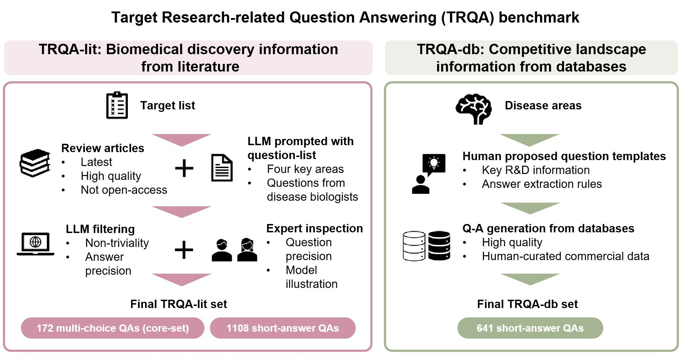
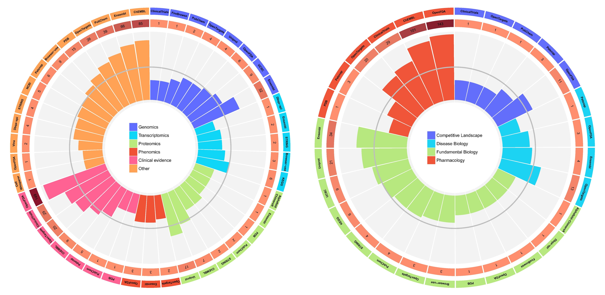

# OriGene: A Self-Evolving Virtual Disease Biologist Automating Therapeutic Target Discovery

> **Important**: This is the Beta release of OriGene, the self-evolving multi-agent system that acts as a virtual disease biologist.
> We also introduce the TRQA Benchmark — a benchmark of 1,921 expert-level questions for evaluating biomedical AI agents.
> We will continue to release updated code over time.

  | <a href="https://GENTEL-lab.io/OriGene">Homepage</a> |
  <a href="assets/OriGene.pdf">Paper</a> |
  <a href="https://github.com/GENTEL-lab/OriGene">Code</a> |
  <a href="https://huggingface.co/datasets/GENTEL-Lab/TRQA/">Hugging Face Benchmark</a> |

## 🧠1. OriGene Overview

Therapeutic target discovery remains one of the most critical yet intuition-driven stages in drug development. We present **OriGene**, a self-evolving multi-agent system that functions as a virtual disease biologist to 
identify and prioritize therapeutic targets at scale. 

## 📊2. TRQA Benchmark Description
To evaluate performance, we constructed TRQA, a benchmark of 1,921 questions specific to therapeutic target identification tasks across multiple disease areas. 

**Target Research-related Question Answering (TRQA)** is a comprehensive evaluation benchmark designed to assess the capabilities of OriGene and similar systems in biomedical reasoning and target discovery.

TRQA evaluates core competencies including:  
- Scientific planning  
- Information retrieval  
- Tool selection  
- Reasoning toward biological conclusions  
- Critical self-evolution  

It spans domains such as fundamental biology, disease biology, pharmacology, and clinical medicine, integrating both scientific literature and real-world data from drug development pipelines and clinical trials.

**TRQA includes two subsets**:
- **TRQA-lit**: Focuses on recent research findings. Includes 172 multiple-choice questions (for rapid model/human comparison) and 1,108 short-answer questions covering key biomedical areas.
- **TRQA-db**: Centers on competitive landscape analysis. Includes 641 short-answer questions that evaluate the ability to retrieve, integrate, and reason over data related to drug R&D and clinical trials.

## 🧪3. Evaluation Results
**Target Research-related Question Answering (TRQA) benchmark leader board**
| Method             | TRQA-lit Choice (Core Set) | TRQA-lit Short-Answer  | TRQA-db  |
|--------------------|----------------------------------|--------------------------------|------------------|
| OriGene            | 0.601                            | 0.826                          | 0.721            |
| o3-mini            | 0.578                            | 0.720                          | 0.487            |
| Claude-3.7-Sonnet  | 0.558                            | 0.695                          | 0.504            |
| DeepSeek-R1        | 0.548                            | 0.714                          | 0.446            |
| DeepSeek-V3        | 0.541                            | 0.768                          | 0.466            |
| GPT-4o-search      | 0.531                            | 0.651                          | 0.493            |
| Gemini-2.5-pro     | 0.529                            | 0.678                          | 0.359            |
| GPT-4o             | 0.512                            | 0.696                          | 0.392            |
| TxAgent            | 0.190                            | 0.472                          | 0.426            |
| Human Group 3 (PhD + 3-5 year exp.)  | 0.523                            | ✗                          | ✗            |
| Human Group 2 (PhD + 1-3 year exp.)  | 0.378                            | ✗                          | ✗            |
| Human Group 1 (senior PhD candidates)  | 0.215                            | ✗                          | ✗            |

## 🧰4. Tools Sets

OriGeneTools integrates over 500 tools to support target discovery and biomedical reasoning.

- On the left, tools are grouped by **multi-omics domians** (e.g., genomics, transcriptomics, proteomics, phenomics, clinical evidence), highlighting OriGene’s ability to process biological data across scales.

- On the right, the same tools are reorganized by **biomedical knowledge domains**: fundamental biology, disease biology, pharmacology, and competitive landscape, reflecting how OriGene supports expert-level reasoning across diverse therapeutic tasks.

## 📄5. License

This code repository is licensed under [the MIT License](https://github.com/GENTEL-lab/OriGene/blob/main/LICENSE).

## 📬6. Contact

If you have any questions, please raise an issue or contact us at [shuangjia.zheng@sjtu.edu.cn](mailto:shuangjia.zheng@sjtu.edu.cn) or [zhongyuezhang@sjtu.edu.cn](mailto:zhongyuezhang@sjtu.edu.cn).

## The full source code is coming soon!
